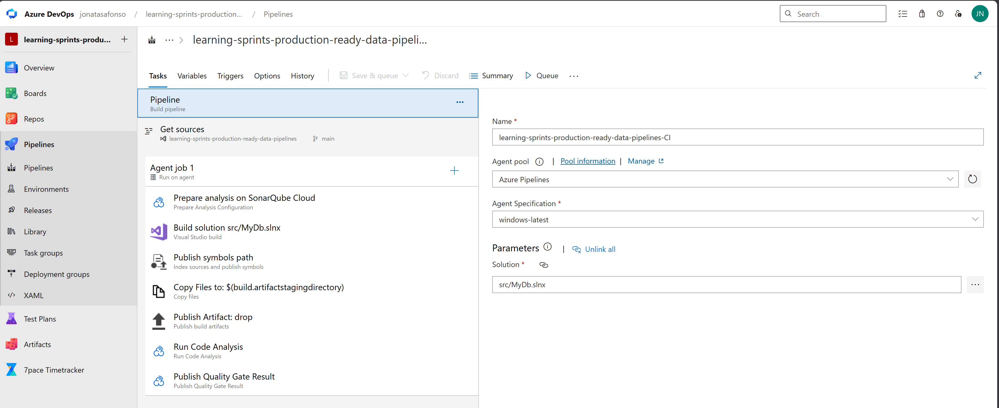
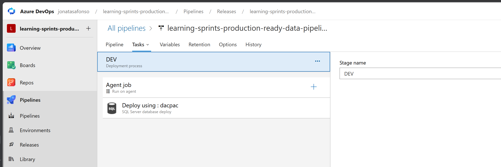
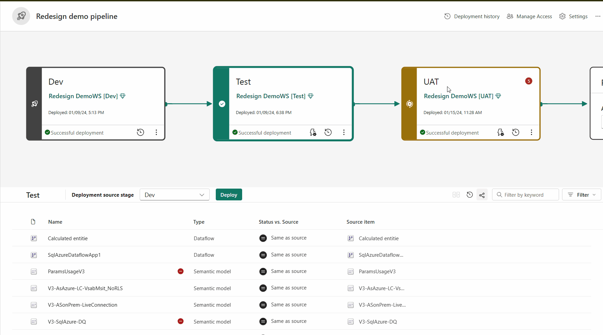

# 🚀 Production-Ready Data Pipelines

### Da experimentação à produção: dados confiáveis, auditáveis e observáveis

---

## ⏱️ Agenda (60 minutos)

1. Contexto e objetivo da sessão (5 min)
2. Por que tantos pipelines falham em produção (10 min)
3. Fases críticas para construir pipelines prontos para produção (15 min)
4. Boas práticas: CI/CD, qualidade e observabilidade (15 min)
5. Armadilhas comuns e anti-patterns (10 min)
6. Encerramento + Q&A (5 min)

---

## 1️⃣ Contexto e objetivo da sessão (5 min)

### O problema real

* A maioria dos pipelines de dados começa bem:

  * um notebook
  * um script Python
  * uma pipeline no Data Factory

* Mas à medida que cresce:

  * surgem falhas difíceis de diagnosticar
  * aparecem problemas de qualidade dos dados
  * ninguém sabe exatamente o que mudou

Resultado prático:

* perda de confiança nos dados
* correções manuais recorrentes
* incidentes difíceis de auditar

👉 O problema **não é a tecnologia**.

👉 É operar pipelines sem práticas de engenharia.

---

### Objetivo da sessão

* Introduzir os princípios de **DataOps**
* Demonstrar como aplicar CI/CD em pipelines de dados
* Explorar qualidade, testes e observabilidade
* Mostrar como transformar pipelines experimentais em ativos de produção
* Evitar:

  * deploys manuais
  * ausência de validações
  * falta de rastreabilidade
  * dependência de conhecimento tribal

---

## 2️⃣ Por que tantos pipelines falham em produção (10 min)

### O ciclo comum dos projetos de dados

| Fase Inicial      | Problema Futuro            |
| ----------------- | -------------------------- |
| Script simples    | Crescimento sem governança |
| Deploy manual     | Erros recorrentes          |
| Sem testes        | Dados incorretos           |
| Sem monitorização | Falhas invisíveis          |
| Sem versionamento | Mudanças não auditáveis    |

💬 Frase-chave:

> "Um pipeline que funciona hoje não é necessariamente um pipeline pronto para produção."

---

### Drivers técnicos e organizacionais

**Técnicos**

* Falta de testes
* Qualidade de dados inconsistente
* Deploys manuais
* Falta de observabilidade

**Organizacionais**

* Dependência de pessoas específicas
* Falta de rastreabilidade
* Dificuldade em reproduzir problemas
* Baixa confiança nos dados

👉 Dados confiáveis exigem processos confiáveis.

---

### Decisão prática

Pergunta-chave:

> "Se este pipeline falhar amanhã às 3 da manhã, sabemos identificar a causa rapidamente?"

Se a resposta for **não**, existe um risco operacional.

---

## 3️⃣ Fases críticas para construir pipelines prontos para produção (15 min)

### Fase 1 — Tratar pipelines como software

Antes de falar de DataOps:

* Código versionado
* Revisão de alterações
* Ambientes separados
* Automação de deploy

Checklist rápido:

* Existe controlo de versões?
* Existe revisão de código?
* Existe histórico de alterações?
* Existe processo de promoção entre ambientes?

---

### Fase 2 — Garantir qualidade dos dados

Qualidade não pode ser uma verificação manual.

Aspectos críticos:

* Validações automáticas
* Regras de negócio
* Deteção de anomalias
* Testes de dados

Perguntas importantes:

* Como sabemos que os dados estão corretos?
* Quem valida a qualidade?
* O que acontece quando uma regra falha?

---

### Fase 3 — Observabilidade e governança

Critérios claros:

* Monitorização contínua
* Alertas automáticos
* Data lineage
* Auditoria das execuções

👉 Sem observabilidade, falhas tornam-se descobertas tardias.

---

## 4️⃣ Boas práticas: CI/CD, Qualidade e Observabilidade (15 min)

### CI/CD para pipelines de dados

* Git como fonte de verdade
* Automatização de deploys
* Promoção controlada entre ambientes
* Pipelines reproduzíveis

Benefícios:

* Menos erros manuais
* Maior velocidade
* Melhor governança

---

### Qualidade de dados automatizada

* Great Expectations
* Regras de validação
* Verificação contínua
* Bloqueio de dados inválidos

💬 Frase-chave:

> "Dados sem validação são apenas uma hipótese."

---

### Observabilidade e rastreabilidade

* Logs estruturados
* Métricas operacionais
* Alertas
* Data Lineage

Benefícios:

* Resolução rápida de incidentes
* Auditoria simplificada
* Maior confiança nos dados

---

## 5️⃣ Armadilhas comuns e anti-patterns (10 min)

### 🚨 Pipeline criado apenas para funcionar

Sinais clássicos:

* Deploy manual
* Sem Git
* Sem testes
* Sem monitorização

👉 Funciona hoje. Torna-se um problema amanhã.

---

### 🚨 Qualidade verificada manualmente

* Conferência em Excel
* Queries manuais
* Dependência de utilizadores

Consequência:

* Erros silenciosos
* Baixa confiança nos dados

---

### 🚨 Falta de observabilidade

* Falhas descobertas pelos utilizadores
* Ausência de alertas
* Sem histórico de execução

Pergunta honesta:

> "Se um pipeline falhar agora, como descobriríamos?"

---

## 6️⃣ Encerramento + Q&A (5 min)

### Checklist final — Production Ready

* Código versionado?
* CI/CD implementado?
* Testes automatizados?
* Qualidade de dados validada?
* Monitoria ativa?
* Auditoria e lineage disponíveis?

### Prática:

#### DataOps com SQLServer

https://jonatasafonso.visualstudio.com/learning-sprints-production-ready-data-pipelines

##### CI

##### CD

#### DataOps com Fabric

https://learn.microsoft.com/pt-br/training/paths/manage-microsoft-fabric-environment/

https://microsoftlearning.github.io/mslearn-fabric/Instructions/Labs/21-implement-cicd.html

https://learn.microsoft.com/en-us/fabric/cicd/deployment-pipelines/intro-to-deployment-pipelines?tabs=new-ui

### Quiz

https://forms.gle/EXTSHLUGS8zTdvJV7

---

### Mensagem final

> DataOps não é sobre ferramentas.
>
> É sobre criar confiança para entregar dados com qualidade, segurança e rastreabilidade.

---

### Próximos passos (pós-sessão)

* Avaliar maturidade atual dos pipelines
* Implementar CI/CD
* Automatizar validações de qualidade
* Adotar observabilidade e lineage
* Reduzir dependência de processos manuais
   

----------

### Links Adicionais

https://learn.microsoft.com/pt-pt/azure/data-factory/continuous-integration-delivery

https://learn.microsoft.com/en-us/azure/data-factory/continuous-integration-delivery-improvements#continuous-deployment-improvements

https://learn.microsoft.com/en-us/training/modules/operationalize-azure-data-factory-pipelines/?source=recommendations

